# Prof P Trade Concentration: Linked Takeaways Flowchart

Sources used:
- Notes PDF: `/Users/tanushsawhney/Downloads/profp`
- Panagariya and Bagaria, "Some Surprising Facts About the Concentration of Trade Across Commodities and Trading Partners": `/Users/tanushsawhney/Desktop/profps26/prof p with nitika.pdf`
- Bernard, Jensen, Redding, and Schott, "The Empirics of Firm Heterogeneity and International Trade": `/Users/tanushsawhney/Desktop/profps26/empirics of firm heterogenity.pdf`
- Eaton, Eslava, Kugler, and Tybout, "Export Dynamics in Colombia: Firm-Level Evidence": `/Users/tanushsawhney/Desktop/profps26/export dynamics in colombia.pdf`

## Master Flowchart

```mermaid
flowchart TD
    A["Central puzzle: trade value is highly concentrated"]

    subgraph F["Observed facts from Prof P and Bagaria"]
      F1["Small share of products accounts for bulk of exports"]
      F2["Small share of products also accounts for bulk of imports"]
      F3["Top partners account for large shares of trade"]
      F4["Bilateral product flows are also concentrated"]
      F5["Countries export/import many products, but only a few at large values"]
      F6["Imports are often nearly as concentrated as exports"]
    end

    subgraph PQ["Prof P questions"]
      PQ1["Why does national trade concentrate across products?"]
      PQ2["Why are imports concentrated in products in the first place?"]
      PQ3["Why are imports not much more diversified than exports?"]
      PQ4["Why do US bilateral imports concentrate more than bilateral exports?"]
      PQ5["Why do small countries show higher export-value concentration?"]
      PQ6["Why do top partners dominate even for different geographies?"]
    end

    subgraph PH["Prof P hypotheses"]
      PH1["Oil and high-unit-value/lumpy goods: aircraft, precious metals, ships, arms"]
      PH2["Oil and petroleum drive some import concentration"]
      PH3["Fragmented production: few component imports support few final exports"]
      PH4["Gravity: partner size, distance, and market-entry costs"]
      PH5["Needed model: at least three countries, components, and heterogeneous firms"]
    end

    subgraph TQ["Your questions"]
      TQ1["Why is export concentration interesting if specialization is expected?"]
      TQ2["Why should comparative advantage span many products?"]
      TQ3["Are small-country concentration patterns mechanical?"]
      TQ4["Are top trade partners simply the biggest or nearest partners?"]
      TQ5["Are the biggest import and export partners usually the same?"]
      TQ6["Which top products are oil, high-unit-value/lumpy goods, components, or policy-sensitive goods?"]
    end

    subgraph TH["Your hypotheses"]
      TH1["Comparative advantage may operate at narrow product or firm-product level"]
      TH2["More product-focused firms may be more likely to export"]
      TH3["Import concentration may reflect one dominant global supplier per product"]
      TH4["US exports may be broad-demand frontier goods, while imports come from specialized producers"]
      TH5["India may lack scale: micro and small firms create thin export reach"]
      TH6["Protectionism and antidumping may distort which products scale"]
      TH7["Rapid export growth may show up as rising product and partner concentration"]
    end

    subgraph SP["What the other papers add"]
      B1["Bernard et al.: exporters/importers are rare, larger, more productive, and self-select"]
      B2["Bernard et al.: top firms dominate trade value"]
      B3["Bernard et al.: high-ability firms export more products to more destinations"]
      B4["Bernard et al.: gravity patterns work through firms and products on the extensive margin"]
      E1["Eaton et al.: new exporters enter often, but most are tiny and exit"]
      E2["Eaton et al.: surviving entrants scale fast and explain much long-run export expansion"]
      E3["Eaton et al.: firms start with one market, then expand through geographic paths"]
      E4["Eaton et al.: nearby/regional markets can be testing grounds"]
    end

    subgraph EX["Exercises and tests"]
      X1["Exercise 1: update Prof P facts beyond 2001 across many countries and years"]
      X2["Exercise 2: measure per-product source concentration for imports"]
      X3["Exercise 3: test whether low-value products go to nearby markets while high-value products go global"]
      X4["Exercise 4: classify top products by oil, high-unit-value/lumpy goods, components, and final goods"]
      X5["Exercise 5: India panel: product concentration, partner concentration, and product-partner concentration"]
      X6["Exercise 6: firm test: product revenue concentration or conglomerate status predicts exporting"]
      X7["Exercise 7: policy test using DGFT and global antidumping data"]
      X8["Exercise 8: growth test: do concentration patterns predict future export growth?"]
      X9["Exercise 9: build a three-country component model with heterogeneous firms"]
    end

    A --> F1
    A --> F2
    A --> F3
    A --> F4
    A --> F5
    A --> F6

    F1 --> PQ1
    F2 --> PQ2
    F6 --> PQ3
    F4 --> PQ4
    F5 --> PQ5
    F3 --> PQ6

    PQ1 --> PH1
    PQ2 --> PH2
    PQ2 --> PH3
    PQ3 --> PH3
    PQ4 --> PH5
    PQ5 --> PH5
    PQ6 --> PH4
    PH3 --> PH5
    PH4 --> PH5

    TQ1 --> TH1
    TQ2 --> TH1
    TQ3 --> X1
    TQ4 --> PH4
    TQ5 --> X5
    TQ6 --> X4

    TH1 --> X4
    TH2 --> X6
    TH3 --> X2
    TH4 --> X2
    TH5 --> X5
    TH6 --> X7
    TH7 --> X8

    B1 --> TH2
    B2 --> TH2
    B3 --> TH1
    B3 --> PH5
    B4 --> PH4
    B4 --> X2
    E1 --> X8
    E2 --> TH7
    E3 --> X3
    E4 --> X3
    E4 --> PH4

    X1 --> X5
    X2 --> PH5
    X3 --> PH5
    X4 --> PH1
    X4 --> PH2
    X5 --> X8
    X6 --> PH5
    X7 --> X8
    X8 --> X9
```

## Clean Research Logic

The flow from the notes and papers is:

1. Prof P and Bagaria document a country-level fact: trade is concentrated across products, partners, and product-partner flows.
2. The hard puzzle is import concentration. Standard specialization stories predict export concentration more naturally than import concentration.
3. High-unit-value goods and oil explain some cases, but not enough. They do not explain why concentration persists for countries without aircraft/oil dominance or after excluding those products.
4. Fragmented production is the most promising Prof P hypothesis, but it is incomplete unless it explains source-country concentration and destination-country concentration too.
5. Bernard et al. give the missing micro mechanism: high-productivity firms self-select into trade, and the largest firms export/import across more products and destinations.
6. Eaton et al. add the dynamic mechanism: many firms experiment at small scale, most fail, surviving firms scale quickly, and market expansion follows geographic paths.
7. Your research agenda should therefore move from country-product concentration to firm-product-country dynamics, with India as a main application.

## Organized Takeaways

| Bucket | Key takeaway | Link in flowchart |
|---|---|---|
| Prof P question | Why are imports concentrated when theory predicts diversified imports? | `PQ2`, `PQ3` |
| Prof P hypothesis | Fragmented component trade can create concentrated imports and exports. | `PH3` |
| Prof P hypothesis | Gravity can partly explain partner concentration but not the full similarity across countries. | `PH4` |
| Your hypothesis | Comparative advantage may show up within narrow product-firm cells, not broad product baskets. | `TH1` |
| Your hypothesis | More concentrated or high-scale firms may be the firms that export. | `TH2` |
| Your hypothesis | Import concentration may come from dominant global suppliers for each product. | `TH3` |
| Your India angle | India's scale problem, firm-size distribution, and policy distortions may shape export concentration. | `TH5`, `TH6` |
| Bernard et al. | Firm heterogeneity explains why a few firms dominate trade value and serve many products/destinations. | `B1`, `B2`, `B3` |
| Eaton et al. | Export growth is driven by selection among entrants, not just the stock of established exporters. | `E1`, `E2` |
| Best next empirical move | Build a panel of product concentration, partner concentration, and product-partner concentration over time. | `X1`, `X5`, `X8` |

## Exercise List

1. Extend Prof P and Bagaria beyond 2001: compute Gini/top-share measures for products, partners, and product-partner cells by country-year.
2. For each HS product, compute whether imports come from one dominant source country or many source countries.
3. Test your nearby-market hypothesis: are small-value or experimental products exported mainly to nearby countries, while high-value specialized products go to many markets?
4. Classify top products into oil/energy, high-unit-value/lumpy goods, components/intermediates, and ordinary goods.
5. For India, compare concentration trends with China, South Korea, Japan, the United States, Germany, and other peers.
6. If firm data are available, regress export participation or export intensity on firm size, product focus, conglomerate status, productivity, and product concentration.
7. Use antidumping or DGFT policy data to test whether protectionist actions shift concentration toward protected sectors or away from globally competitive sectors.
8. Test whether product concentration, partner concentration, and product-partner concentration predict future export growth.
9. Develop the three-country model: one assembler/exporter, one component supplier, one final-demand market, with heterogeneous firms and fixed product-market entry costs.

## Model Skeleton

The model suggested by the flowchart should have:

- Three countries: an assembling/exporting country, a component-source country, and a destination market.
- Heterogeneous firms: only high-productivity firms cover fixed export and product-scope costs.
- Product scope: high-ability firms choose more products and more destinations.
- Component trade: concentrated component imports support concentrated final-good exports.
- Partner choice: gravity, entry costs, and learning determine which source/destination partners dominate.
- Dynamics: entrants test markets at small scale; survivors expand products and destinations.

The predicted empirical object is not just country-product concentration, but concentration in the country x product x partner cell, with firm heterogeneity underneath.
